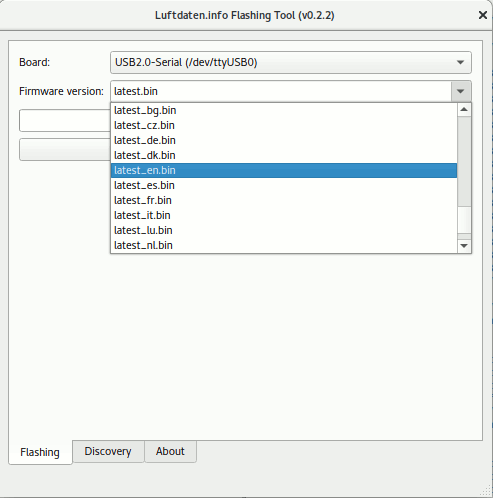
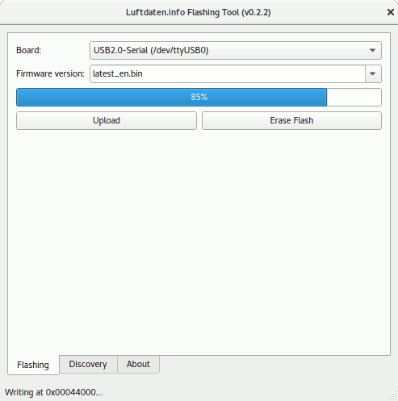

# Sensor.Community flashing tool

## Binary builds and downloads

Our main target is having working prebuilt binaries for users to simply download and run, to avoid all the setup below.
See [releases](https://github.com/opendata-stuttgart/airrohr-firmware-flasher/releases) to download the software for your system.

Note: you need drivers for the USB2serial chipset:

* Drivers for NodeMCU v3 (CH340)

    * [Windows](http://www.wch.cn/downloads/file/5.html) (Windows 10 should be able to automatically download these; [2018/09/04 v3.4 mirror](https://d.inf.re/luftdaten/CH341SER.ZIP))
    * [MacOS](http://www.wch.cn/downloads/file/178.html) ([2018/09/04 v1.4 mirror](https://d.inf.re/luftdaten/CH341SER_MAC.ZIP))

* Drivers for NodeMCU v2 ([CP2102](https://www.silabs.com/products/development-tools/software/usb-to-uart-bridge-vcp-drivers))

    * [Windows 10](https://www.silabs.com/documents/public/software/CP210x_Universal_Windows_Driver.zip), [Windows 7/8/8.1](https://www.silabs.com/documents/public/software/CP210x_Windows_Drivers.zip) (Windows 10 should be able to automatically download these)
    * [MacOS](https://www.silabs.com/documents/public/software/Mac_OSX_VCP_Driver.zip)

On Linux you should not need drivers, as they are usually already there, but you need to check that you as user have the permission to use the serial devices (otherwise you likely see an error like *serial.serialutil.SerialException: [Errno 13] could not open port /dev/ttyUSB0: [Errno 13] Permission denied: '/dev/ttyUSB0'*). 

* Debian/Ubuntu: add your user to the group `dialout` with `sudo usermod -a -G dialout ${USER}` (you may need to restart the desktop to apply your new group settings).

## Using the software

Linux users: Please check that the downloaded file is executable. Otherwise set the executable bit with `chmod u+x <filename of download>`

To flash a device:

1. connect the ESP8266 with a USB cable to your computer (micro-USB)
2. launch the downloaded software
3. check/select the serial device
4. select the firmware (`latest_<COUNTRYCODE>.bin` should be fine for any setup)
5. press button *Upload*
6. wait for a few seconds to finish the flashing procedure
7. take a note of the **Sensor ID** written in the Window status bar at the bottom - you will need it to register the sensor

If you want to delete/reset all settings on the device (e.g. the Wifi credentials) you can use the `Erase Flash` button (exists in software version 0.2.2 and above).

### Screenshots

")

### Further steps

Now your device is flashed, you may now 

1. connect the sensors to it, 
2. configure the WiFi (connect your computer/smartphone to the AP `feinstaubsensor-<sensorID>` and open up http://192.168.4.1/ in a browser) and 
3. finally register the sensor at https://devices.sensor.community/ with your *Sensor ID*

## Building the software

### Linux

Currently Linux builds require *Python 3.6* (but 3.7 seems to work fine as
well), GNU make and Qt Linguist tools. Following packages should suffice on
Ubuntu (tested on Ubuntu 18.04):

    sudo apt install qttools5-dev-tools pyqt5-dev-tools qt5-default python3-pip python3.6 make

On Fedora (tested on Fedora 31):
    
    sudo dnf install qt5-qttools-devel python3-devel make
    sudo ln -s /usr/bin/lrelease-qt5 /usr/bin/lrelease

If you want to build in a python virtualenv (recommended) you should create one with

	pip install virtualenvwrapper
    mkvirtualenv -p "$(which python3)" airrohr-firmware-flasher
    # deactivate # to leave the virtualenv later
    # workon airrohr-firmware-flasher to re-enter virtualenv

Then, to install python dependencies and build the binary use:

    sudo pip install --upgrade pip
    make deps dist

The built binary will be `dist/airrohr-flasher`.

### Windows

Currently Windows builds require *Python 3.6* installed system-wide and added to
`%PATH%`.

To install python and cygwin dependencies and build everything use
`deploy\windows-build.bat` batch script.

### MacOS
Currently MacOS builds require *Python 3.6*, `dmgbuild` tool (`pip3 install
dmgbuild`) and Qt SDK installed (just the "Qt >
5... > macOS" part in installer) with following added to $PATH (check version part):

    export PATH="$HOME/Qt/5.11.1/clang_64/bin:/Library/Frameworks/Python.framework/Versions/3.6/bin:$PATH"

Then just install dependencies and build everything using:

    make deps dmg

### Binary build debugging

In case an error occurs in early stages of application startup, user will be
presented with a "Failed to execute script airrohr-flasher.exe" message. In order
to see actual source of that error, `console` flag in `airrohr-flasher.spec` can
be switched to `True`. In Windows this will make application output a proper
stack trace to `cmd` popup.

## Development

Both build & runtime requirements are defined in `requirements.txt` file. In
order to install these use the following command:

    pip install -r requirements.txt

To manage dynamic UI and translation binaries generation we use a very simple
GNU make-based build system.

To simply build everything needed to run `airrohr-flasher.py` run:

    make

To build and run use:

    make run

To remove all build artifacts use:

    make clean

All requirements are set up using wildcards, so, in theory, `Makefile` shouldn't
need much changes in near future.

## Translations

All translation files are located in the `i18n` folder. The files have to be named
with the language name accourding to https://doc.qt.io/qt-5/qlocale.html#Language-enum (part after `QLocale::`).

The translations can be done with the following tool:
https://github.com/thurask/Qt-Linguist/releases (Windows binaries, sources available)

Manual translation can be done by editing the .ts file. 

### If english texts are added or changed

In order to rebuild `*.ts` files use:

    make i18n-update
